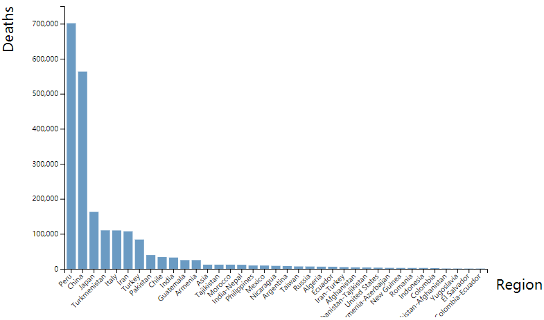
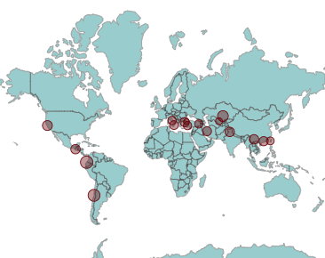
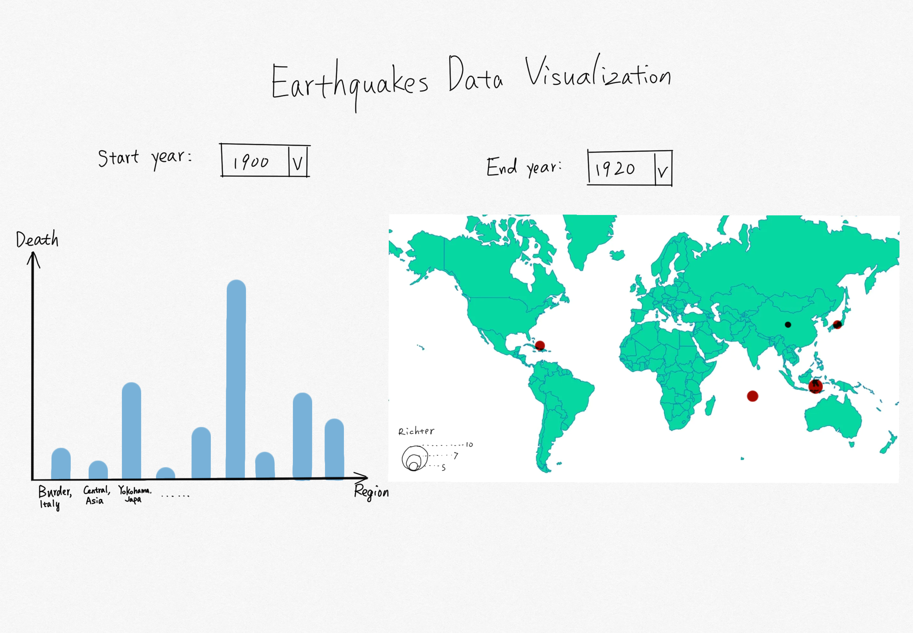

# Data Visualization Project

## Data

The data I propose to visualize for my project is the global earthquake dataset in 1900-1999.

Data link: [Junying Li's Gist](https://gist.github.com/Junying-Li/72ef4641efd6b4abf371f5d9f4267a56)

## Prototypes

I’ve created a proof of concept visualization of this data. Here are prototypes of a bar plot and a bubble world map. The bar plot shows the total deaths in earthquakes of different regions. The bubbles on world map shows the positions where earthquakes occured and the radius shows richter of earthquakes.

## Questions & Tasks

The following tasks and questions will drive the visualization and interaction decisions for this project:
* How often did earthquakes occur from 1900 to 1999? 
* Is there any correlation between Richter and deaths?
* Where did earthquakes occur most? 
* Did earthquakes always happen in the edges of earth's crust?

## Sketches

The sketch contains 2 linked interactive visualizations, which are a bar plot, and a bubble world map. 

The bar plot shows the total deaths of different regions, and the bubble world map shows where the earthquakes occured and how strong the earthquakes were (by richter scale), just like the prototypes above. The 2 visualizations are linked, bar plot and bubble world map will show filtered data in selected timeslot. 

## Interactions

There is also interactive part of this project. As you can see in the sketch, there are two drop down menus on the top this visualization. One menu for choosing start year and the other for choosing end year. When user chooses a time slot, bar plot and buuble world map will update to show filtered data in selected time slot immidiately.

## How this visualization answers questions

Making use of the drop down menu can help to answer the first question (How often did earthquakes occur from 1900 to 1999?). In selected timeslot, more circles in world map means more earthquakes occured. Since the bar plot and world map are linked, we can answer the second question (Is there any correlation between Richter and deaths?) by comparing the total deaths and radius of circles of each region. The world map view can help to answer the third question and the fourth (Where did earthquakes occur most? Did earthquakes always happen in the edges of earth's crust?) by the distribution of circles on the map.

## Open Questions

How to add mouse even on transitional visualization?
