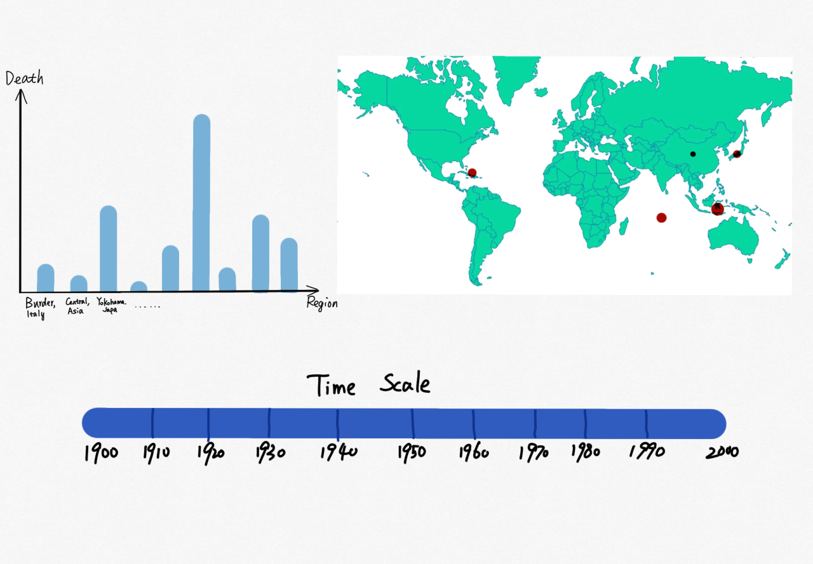

# Data Visualization Project

## Data

The data I propose to visualize for my project is the global Earthquake dataset in 1900-1999. 

## Prototypes

I’ve created a proof of concept visualization of this data. It's a bar plot and it shows the deaths in earthquakes of different regions. 

## Questions & Tasks

The following tasks and questions will drive the visualization and interaction decisions for this project:
* How often did earthquakes occur from 1900 to 1999? 
* Is there any correlation between Richter and deaths?
* Where did earthquakes occur most? 
* Did earthquakes always happen in the edges of earth's crust?

## Sketches

The sketch contains 3 linked visualizations, which are a bar plot, a world map, and a timescale. 

The bar plot shows the deaths of different regions, just like the prototype above. The world map shows where the earthquakes occured by adding circles on the map. And the radius of circles shows the Richter, in other words, the higher the Richter, the bigger the circle. And the timescale should allow users to chose timeslot by a sliding window. These 3 visualizations are linked, bar plot and world map will show data points of selected timeslot. 

Making use of the timescale can help to answer the first question (How often did earthquakes occur from 1900 to 1999?). In selected timeslot, more circles in world map means more earthquakes occured. Since the bar plot and world map are linked, we can answer the second question (Is there any correlation between Richter and deaths?) by comparing the death and radius of circle. The world map view can help to answer the third question and the fourth (Where did earthquakes occur most? Did earthquakes always happen in the edges of earth's crust?) by the distribution of circles on the map.

## Open Questions

I don't know what's the best way to link the 3 visualizations together. Also, I'm not sure if I needed to preprocess the dataset, for instance, adding latitude and longitude for each region.
