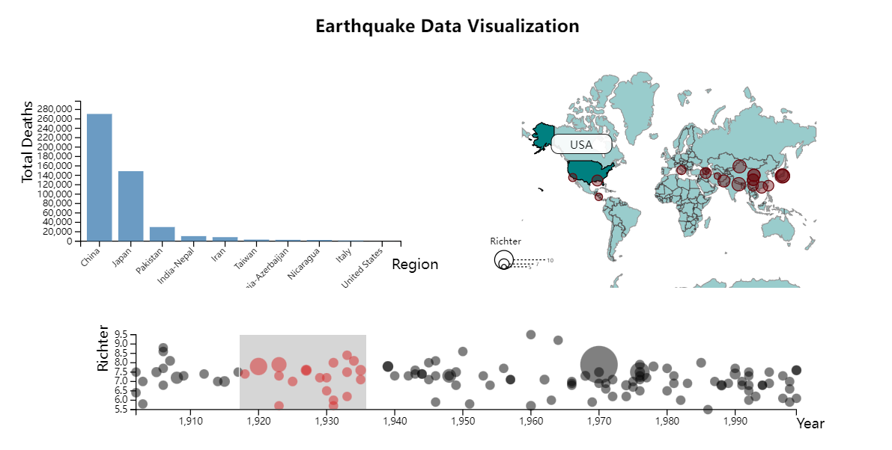
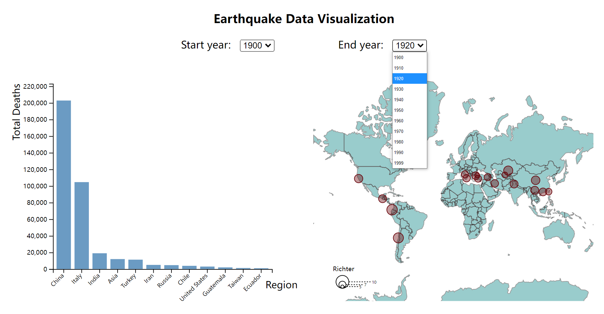
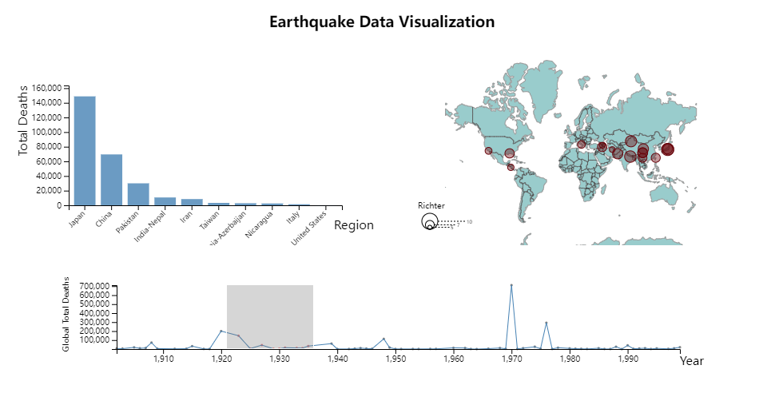

# Data Visualization Project

## Data

The data I propose to visualize for my project is the global earthquake dataset from 1900 to 1999.

Data link: [Junying Li's Gist](https://gist.github.com/Junying-Li/72ef4641efd6b4abf371f5d9f4267a56)

## Intro Video

Intro video on Youtube: [CS573 Final Project Video](https://youtu.be/dqsqsrSXz0c)

## Prototypes

I’ve created a proof of concept visualization of this data. Here are prototypes of a bar plot and a bubble world map. The bar plot shows the total deaths in earthquakes of different regions. The bubbles on world map show the positions where earthquakes occurred and the radius shows Richter of earthquakes.

*Figure-1 Bar Plot*

*Figure-2 Bubble World Map*

- Update 11.17

For this week's update, I create a new visualization prototype just as I've planned last week. As you can see in Figure-3, it is a line chart. The X-axis shows the timeline (year), and the Y-axis shows the global total deaths in each year. I also added a brush to it to make it interactive. The features of the brush are the same as the update on 10.27. 

What I've learned this week are d3.group and d3.rollup. To summarize the global total deaths for each year, I decided to find relevant API functions in d3 instead of simply utilizing algorithms and data structures in JavaScript. After searching and reading documents for a while, I found d3.group and d3.rollup fit my requirements pretty well. In the end, I successfully implemented my new visualization by making use of these two API functions.

For future work, I will put this prototype to my main project, and make it linked with the other two visualizations.

*Figure-3 Line Chart*

## Iterated visualizations

- Update 10.27

Link: [Iterated work - brush, tooltips and legend](https://vizhub.com/Junying-Li/c51fe87e3c5d48a4b5794ec903f35da4)

In this visualization, I added a scatter plot to show the distribution of earthquakes over time, the scatter plot also shows deaths of earthquakes by the circles' radius. 

To interactive with users, I added a brush on the scatter plot. User can select a time slot by using the brush. Circles in the selected time slot will change color to red, and the bar chart and bubble world map will show data in selected time slot. User can also select all data points by double click the scatter plot, or unselect a time slot by double click on selected zone.

I also added tooltips and legend to the bubble world map, when users put their mouse on the map, the tooltip will show the country or region name of it.

For future work, I will create another bar plot that shows the total deaths of different years, then link it with other visualizations by brush.

- Update 11.10

Link: [Iterated work - dropdown menus](https://vizhub.com/Junying-Li/b7235be55f544d108affb47ca80fbb16)

In this visualization, I added two dropdown menus as I designed in my sketch. Users can choose start date and end date by utilizing the dropdown menus. Now, everything in my sketch has been implemented. 

For future work, I will create a bar plot or a line chart and make it link with other visualizations.

- Update 11.23

Link: [Iterated work - line chart & brush](https://vizhub.com/Junying-Li/bd4c4ab2541e4f648df2a536976973aa)

For this week's update, I embeded the line chart to my multi view visualization. The bar plot and bubble world map are linked with the line chart by brush.

## Questions & Tasks

The following tasks and questions will drive the visualization and interaction decisions for this project:
* How often did earthquakes occur from 1900 to 1999? 
* Is there any correlation between Richter and deaths?
* Where did earthquakes occur most? 
* Did earthquakes always happen at the edges of the earth's crust?

## Sketches

*Figure-3 Project Sketch*

The sketch contains 2 linked interactive visualizations, which are a bar plot, and a bubble world map. 

The bar plot shows the total deaths of different regions, and the bubble world map shows where the earthquakes occurred and how strong the earthquakes were (by Richter scale), just like the prototypes above. The 2 visualizations are linked, bar plot and bubble world map will show filtered data in the selected timeslot. 

## Interactions

This project also has interactions. 

- Drop-down menus
As you can see in the sketch, there are two drop-down menus on the top. One menu for choosing the start year from 1900 to 1999 and the other for choosing the end year from 1999 to 1900. When the user chooses a time slot, the bar plot and bubble world map will update to show filtered data in the selected time slot immediately.

- Tooltips
When user put mouse over or out on the world map, there will be a tooltip that shows the country's name. In addition, the selected country will be emphasized by heavier color.

## How this visualization answers questions

Making use of the drop-down menu can help to answer the first question (How often did earthquakes occur from 1900 to 1999?). In the selected timeslot, more circles on the world map means more earthquakes occurred. Since the bar plot and world map are linked, we can answer the second question (Is there any correlation between Richter and deaths?) by comparing the total deaths and radius of circles of each region. The world map view can help to answer the third question and the fourth (Where did earthquakes occur most? Did earthquakes always happen in the edges of the earth's crust?) by the distribution of circles on the map.

## Schedule of Deliverables

- Create a world map. (1 day / 10.10)
- Add drop-down menus. (1 day / 10.15)
- Make sure the drop-down menu output the required data. (1 day / 10.17)
- Make sure the bar plot works well, using data filtered by the output of the drop-down menu. (2 days / 10.22)
- Add bubbles on the world map, using data filtered by the output of the drop-down menu. (5 days / 10.30)
- Add legend for the map. (1 day / 11.2)
- Add tooltips for the map. (2 days / 11.6)
- Remove buttons. (0.5 day / 11.8)
- Add title and other useful text. (0.5 day / 11.9)
- Change the layout of page elements. (1 day / 11.13)
- Refine the whole project. (7 days / 11.25)
- Make sure the whole project works well. (3 days / 11.31)
- Submit the final project. (1 day / 12.9)
